# REAL TIME CHAT PROJECT

# ----------------------------------------------------------------
# AUTHOR
# ----------------------------------------------------------------

This project was developed for Naudys Reina as an assessment
for the Senior PHP Developer position on September 2nd, 2024.

# ----------------------------------------------------------------
# TECHNOLOGIES
# ----------------------------------------------------------------

It was used PHP version 8.2.8, and Javascript. It's required
to have a local web server (Apache, Nginx, etc), MySQL, Redis and at least the above-mentioned
PHP version.

The app was developed using JQuery and Ajax to avoid PHP server reloads, also makes it look like a SPA.

Redis was implemented as a cache feature, and it can be configured inside the .env file.

# ----------------------------------------------------------------
# .ENV FILE
# ----------------------------------------------------------------

The .env file includes the following variables

MYSQL_URL: "URL of the MySQL connection in the following format: "mysql:host=127.0.0.1; port=3305; dbname=rtvc_php" "
MYSQL_USERNAME: "MySQL username"
MYSQL_PASSWORD: "MySQL password" 

REDIS_URL: "URL of the Redis connection in the following format: "tcp://localhost:6379" "
REDIS_ENABLE_CACHE: "Enable or disable Redis feature. Example: "true" or "false" "
REDIS_CACHE_EXP_TIME: "Redis cache expiration time expressed in seconds. Example: 10 "

STUN_SERVER: "STUN server to be used on webrtc connection. Example: "stun:stun.test.ca:80" "
TURN_SERVERS: "TURN servers which will be used on the webrtc connection. Example: "'[{"urls":"turn:global.test.ca:80","username":"test","credential":"test"},{"urls":"turn:global.test.ca:80?transport=tcp","username":"test","credential":"test"},{"urls":"turn:global.test.ca:443","username":"test","credential":"test"},{"urls":"turns:global.test.ca:443?transport=tcp","username":"test","credential":"test"}]'" "
Careful with single quotes or double quotes when stringify TURN_SERVERS

# ----------------------------------------------------------------
# MAKE IT WORK
# ----------------------------------------------------------------

To make it work, follow the next steps:

- Create a MySQL database, you can put the name you want.

- Execute the script.sql file inside the database folder into the MySQL database.
This script contains the necessary tables to make this application work,
also it contains two initial users, which can be used to test it.
The credentials for both users are:

User 1:
email: test1@test.com
password: password

User 2:
email: test2@test.com
password: password

- Check the .env file and put the correct values inside of it. Inside is the database connection values, or the stun or turn servers.

- Put the content of this folder in the local web server, you can put the name you want.

- Go to the command line, change the directory to the root folder and run the server using the following command: 
php .\bin\server.php (This server is related to the websocket)

Go to your browser and type your local web server url and folder, where is located the code.
If everything is fine, you'll be able to use the application correctly and you'll see the Login page.

# ----------------------------------------------------------------
# FEATURES IN THE APP
# ----------------------------------------------------------------

The tests were done using Google Chrome browser. This browser has the highest compatibility with this project, specially with the video call feature.

- If you want to register a new user, click on the link "Don't have an account? Register"

Inside the code there are internal validations to check if the username or email are unique, and also if fields are empty or not.

When an user is registered correctly. You'll see confirmation popup

- Also you can use one of the above credentials to access. Then you'll see the Home page

Also it can be checked if the connection to the websocket is working.

- Inside the home page, there are the following features:

- If you select one of the users inside the user list, you'll see the video view.

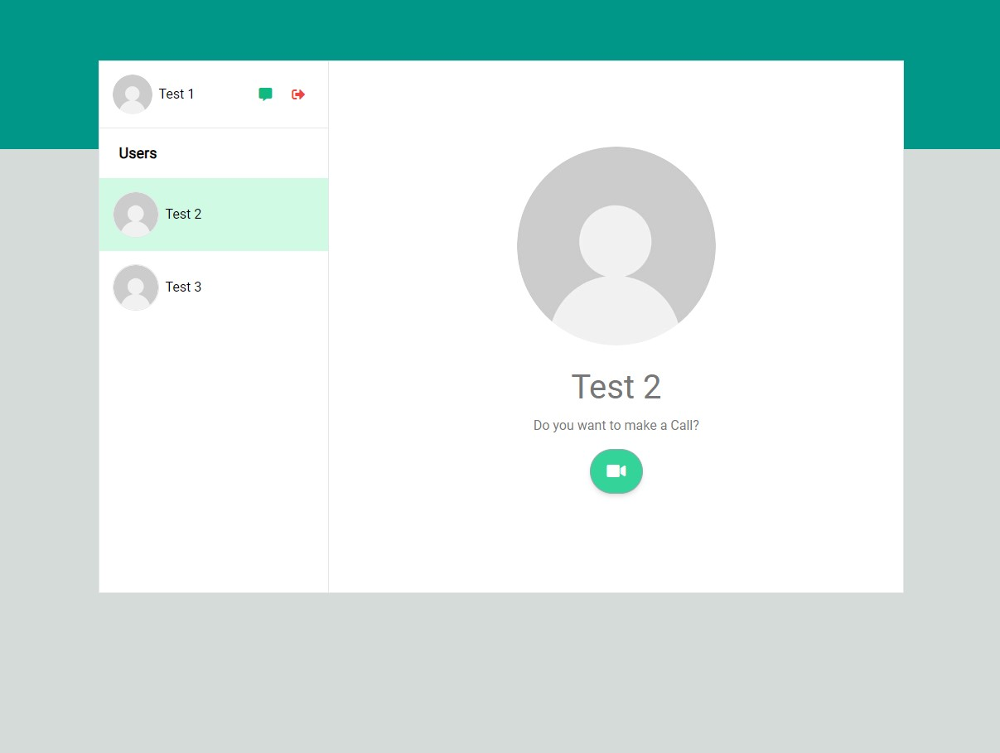

- If you want to switch to the chat view, click in the green chat button next to the current user. If you want to go back to video view, click on the same button.
You'll see the button icon changes if you have the chat or video view displayed.

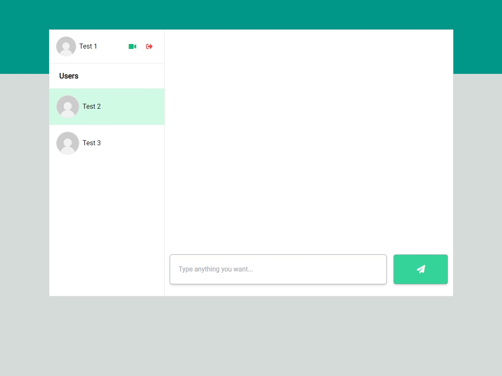

- To test chat real time interactivity, you can have two browsers, and login with different accounts on every browser.
Then go to chat view on both of them and start sending messages. You'll see they are being reflected using websocket.

If you send from user test 1 one message to user test 2 with the message "Hello User 2", you'll see the exchange of messages inside the socket.

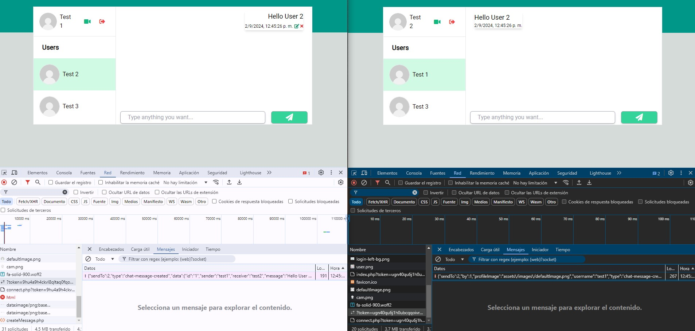

If you send another message but now in the opposite direction, you'll also see the exchange of messages inside the socket.

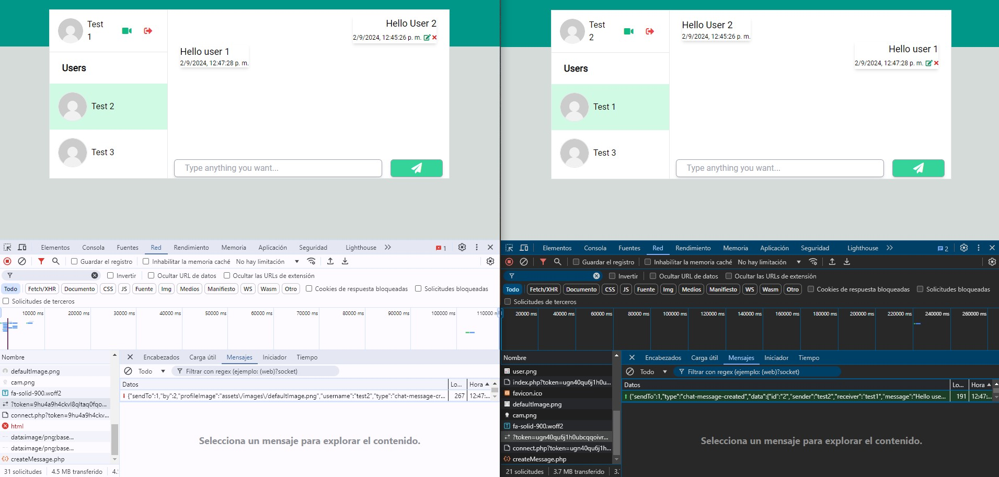

Also the message can be edited or deleted from the user who created them. Let's edit the message of user test 1 to say "Hello again User 2".
If you click the pencil icon inside the message, you'll see a popup, where you can edit the message and then you can click again in the pencil icon.

Then you'll see the websocket interactivity letting the user test 2 know that a message changed and it should change the content of that message.

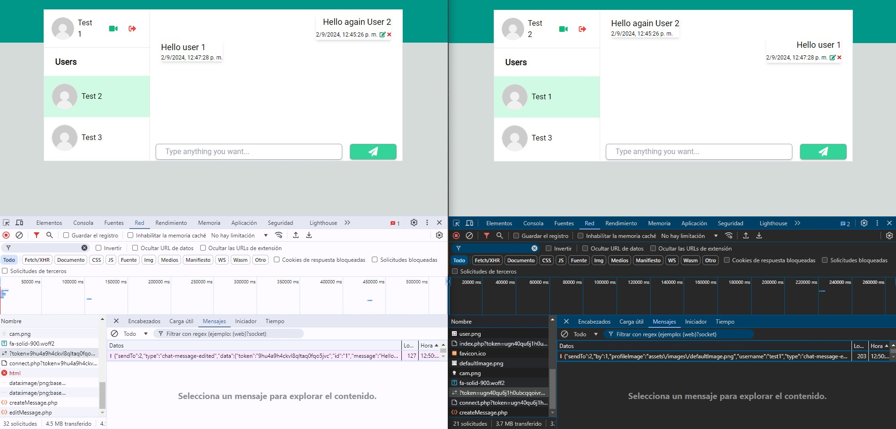

If you want to delete a specific message, click on the close icon inside the message. The message will be deleted, and the other user will be informed
that the message was deleted, so, it should remove it from the messages list.
Let's delete the message the user test 2 created: "Hello user 1"

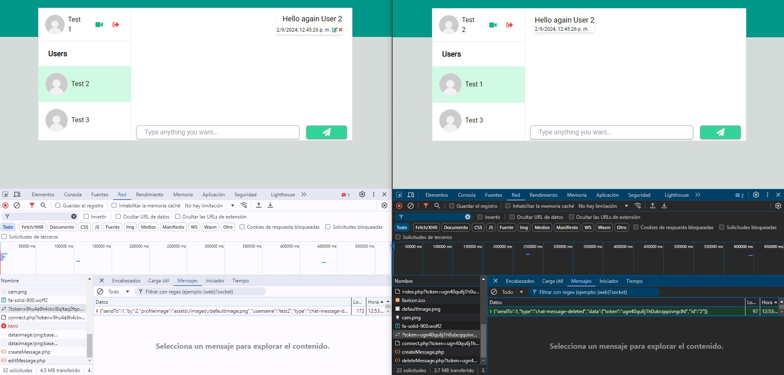

- To test real time video chat, you also need two browsers and the same logic mentioned above. But you need to be in the video view.
Click in the video button below the message "Do you want to make a Call?". This sends a message through the websocket to the other user, which will display
a popup.

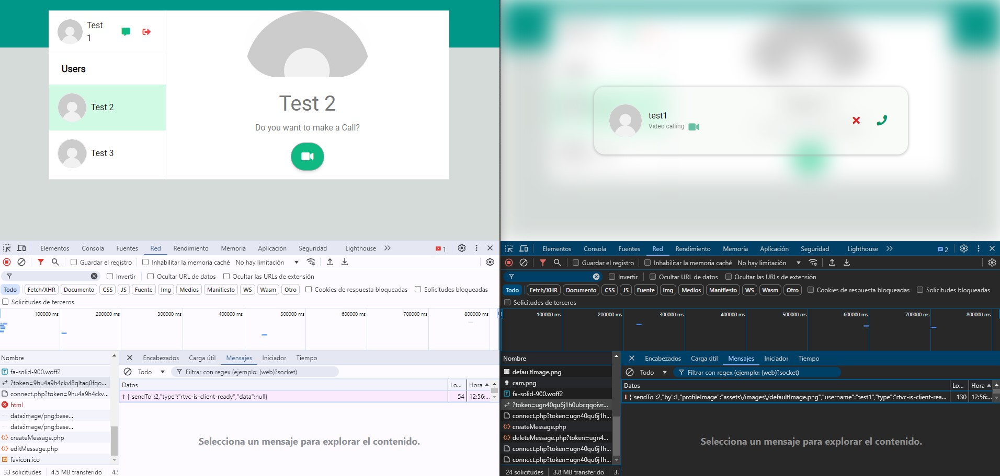

If you cancel the video call, the user who sent the video request will receive a message through the websocket, which contains the rejection of the request.

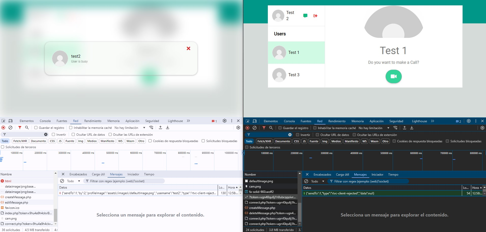

If any of the users don't have the video and audio permissions, those will be requested.

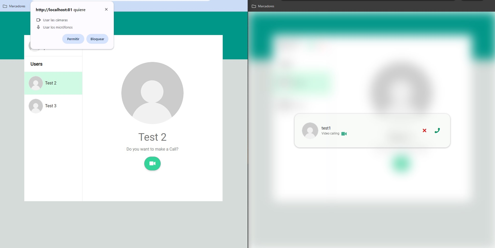

If you accept the video call, both of the users will send messages through the websocket with the steps to establish the communication. And if everything went fine,
both of the users will share video and audio and the video call will be active.

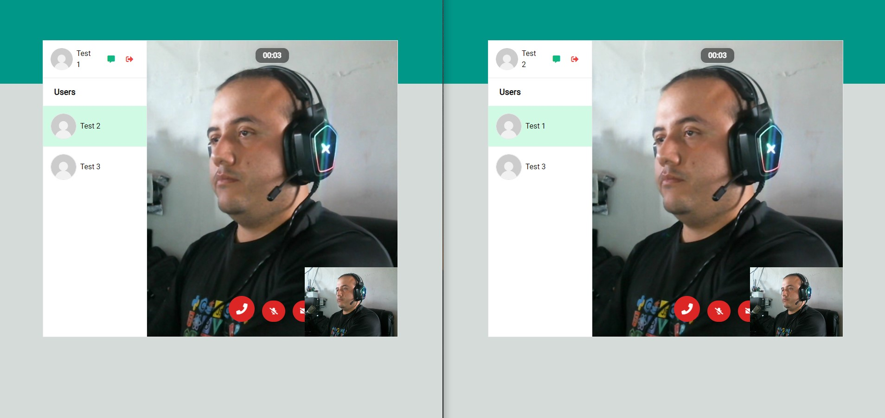

Inside the active video call, you'll have three buttons:
Hangup call, enable or disable microphone, and enable or disable video.
And there are also the local video section, the remote video section and the time counter.
You can see them in the following image.

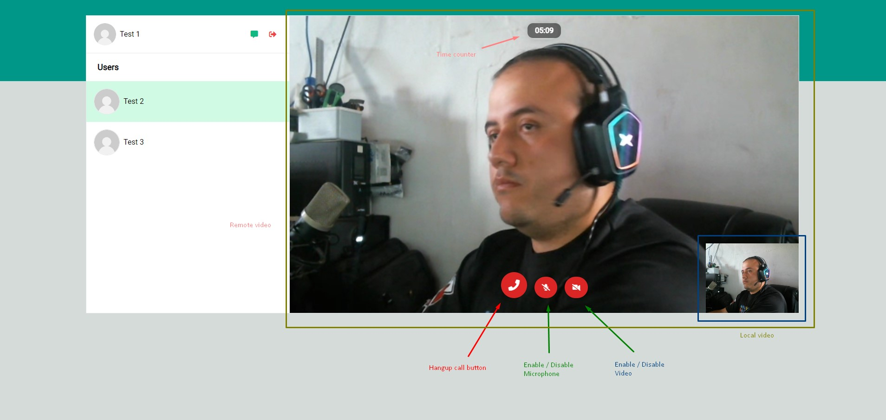

If you want to disable the microphone or the video. The button will change indicating the change. And the stream between the users won't include that feature.
Let's say you want to disable the video of user test 1, the remote user test 2 won't get the video feature from user test 1.

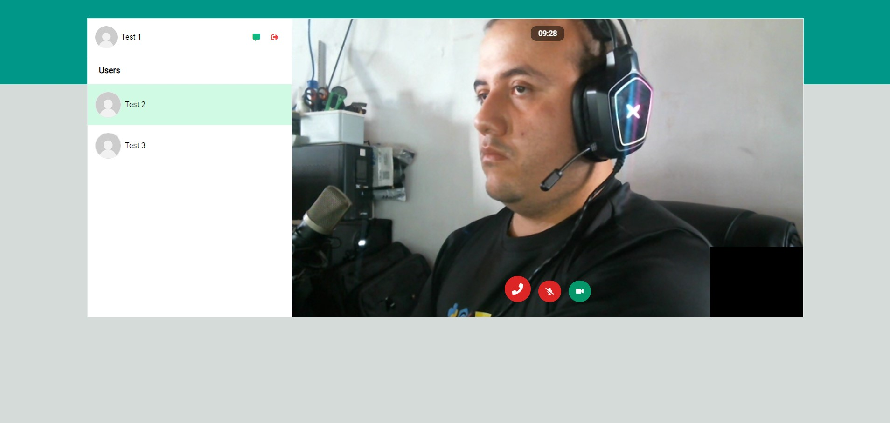

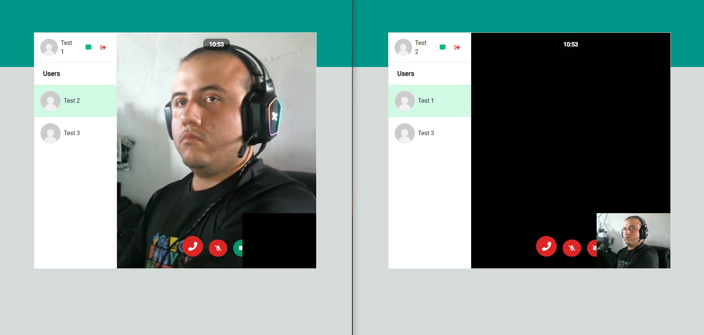

If you hangup the video call from the user test 1, the user test 2 will receive a message through the websocket letting he know that user test 1 hang the call up.

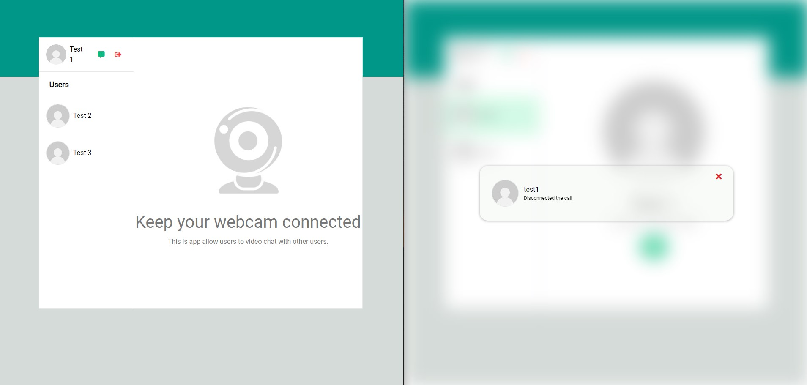

If for some reason one of the users lost internet connection, after 10 seconds the video call will be finished for the users.
This can be simulated by refreshing the page of user test 1.

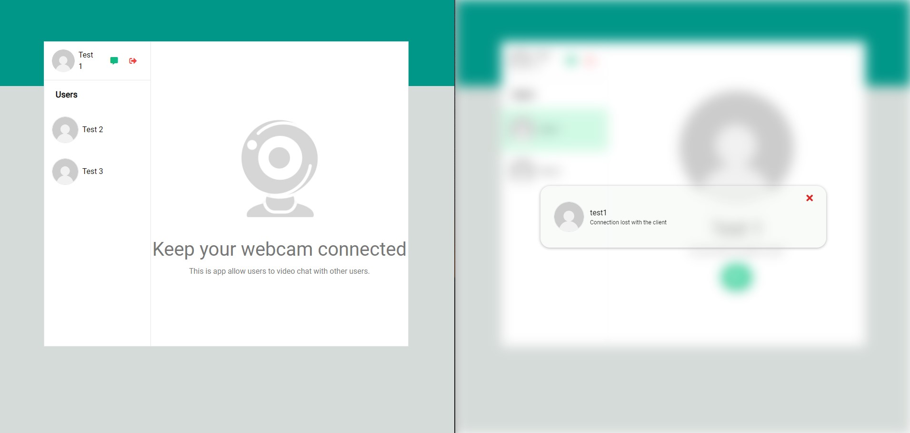

- And finally if you want to logout just click on the logout button. The websocket connection will be closed and you'll be returned to the login page.

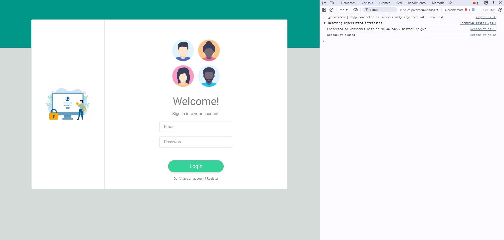

- You can check the server logs and you'll see when a user is connected or disconnected.

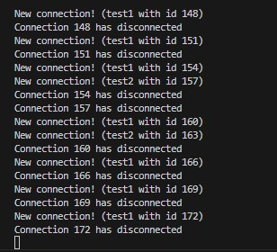